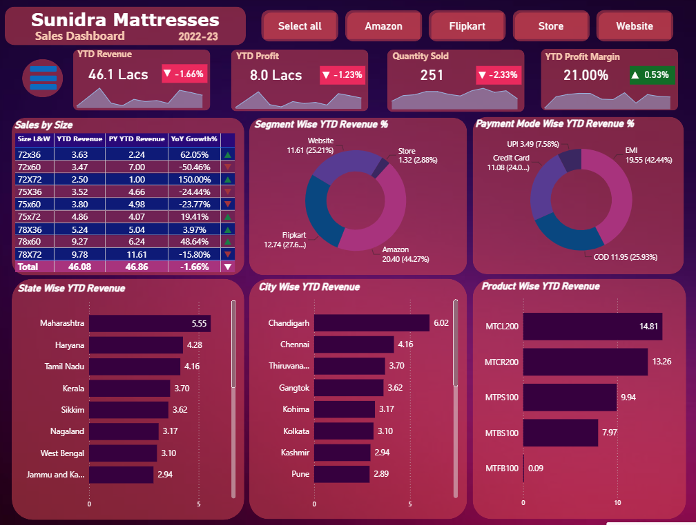
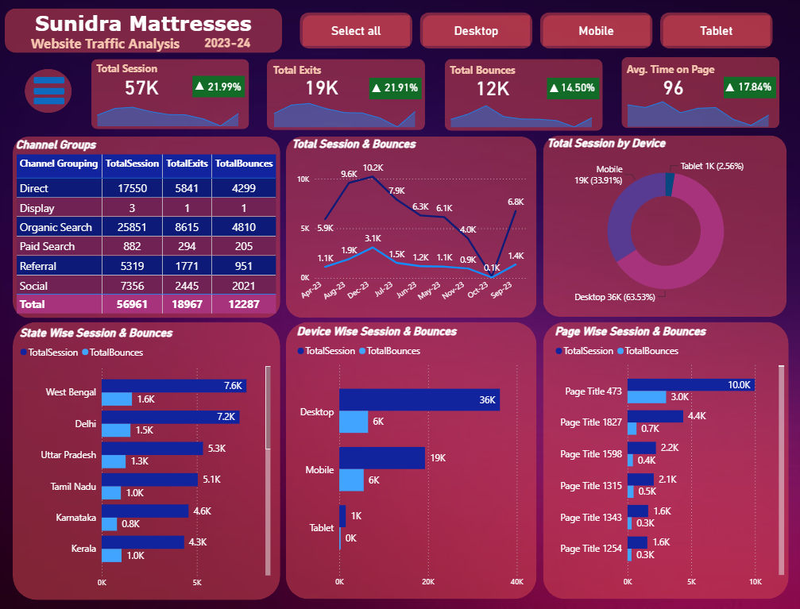
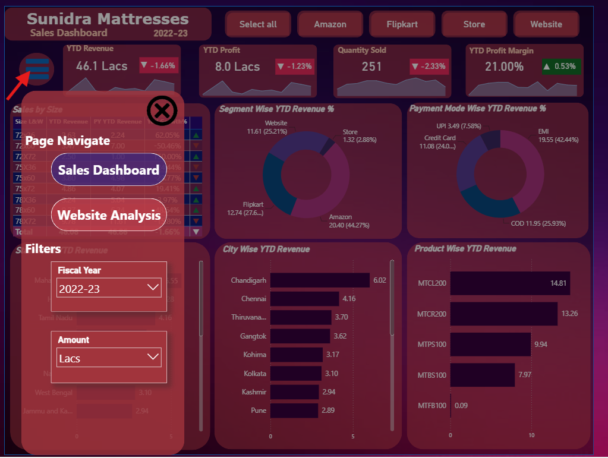
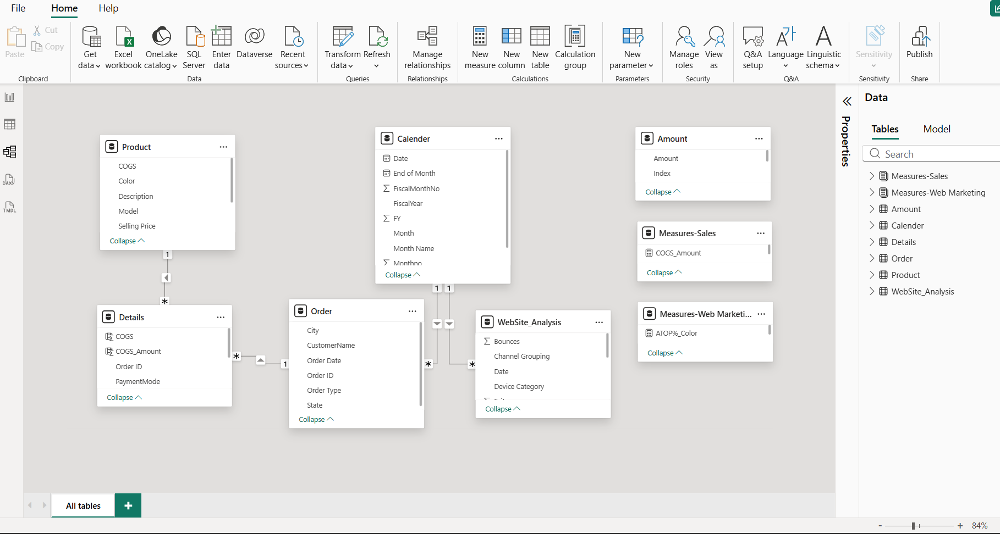
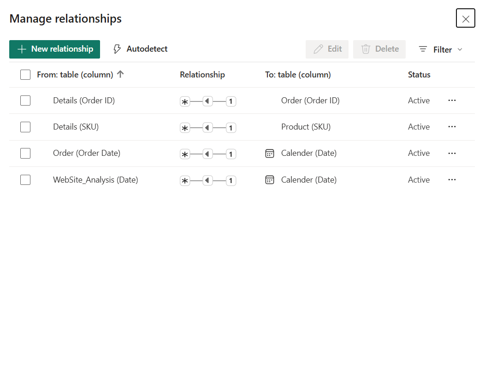

# Sunidra Mattresses Sales & Web Analytics Dashboard

## Project Overview

This Power BI project was developed for Sunidra Mattresses, a premium mattress brand by Eastern Mattresses Pvt. Ltd. The solution combines Sales Analytics and Web Analytics into a single interactive reporting platform, enabling stakeholders to monitor business performance, customer engagement, and marketing effectiveness.

The dashboard provides a comprehensive view of sales trends, profitability, product performance, customer behavior, and website traffic, helping management make data-driven business decisions.

---

## Business Problem

The business needed a centralized reporting solution to answer critical questions:

* Which products generate the highest revenue and profit?
* Which sales channels contribute the most to business growth?
* How do customers interact with the company website?
* Which marketing channels drive the most traffic?
* What factors influence customer engagement and conversions?
* How can sales and marketing performance be optimized?

---

## Solution

Developed an end-to-end Power BI solution consisting of:

### Sales Analytics Dashboard

Provides visibility into:

* Revenue Performance
* Profit Analysis
* Product Category Performance
* Sales Channel Analysis
* Geographic Sales Distribution
* Payment Method Analysis
* Customer Purchase Trends

### Web Analytics Dashboard

Provides insights into:

* Website Sessions
* User Engagement
* Bounce Rate Analysis
* Exit Page Analysis
* Traffic Source Performance
* Device Usage Analysis
* Geographic Traffic Distribution

---

## Dashboard Screenshots

### Sales Dashboard



### Web Analytics Dashboard



### Navigation & Filters



### Data Model



### Table Relationships



---

## Key Business Metrics

### Sales Metrics

* Total Revenue
* Total Profit
* Profit Margin
* Product Performance
* Channel Contribution
* Sales by Region
* Payment Method Distribution

### Web Analytics Metrics

* Total Sessions
* Bounce Rate
* Exit Rate
* Average Session Duration
* Device Usage
* Traffic Source Analysis
* User Engagement Metrics

---

## Data Model

The solution uses a star-schema-inspired data model designed for efficient reporting and scalability.

### Core Fact Tables

* Sales Transactions
* Website Analytics

### Dimension Tables

* Product
* Date
* Geography
* Sales Channel
* Device Type
* Traffic Source

The model enables fast filtering, drill-down analysis, and accurate KPI calculations.

---

## Technical Highlights

### Power BI Features Used

* Data Modeling
* DAX Measures
* Power Query Transformations
* Interactive Slicers
* Drill-Down Navigation
* KPI Cards
* Dynamic Filtering
* Custom Visualizations

### DAX Calculations

* Revenue Metrics
* Profit Metrics
* Growth Calculations
* Conversion Metrics
* Traffic Analysis Measures

---

## Tools & Technologies

* Power BI Desktop
* Power BI Service
* DAX
* Power Query
* Microsoft Excel
* Data Modeling
* Data Visualization

---

## Skills Demonstrated

* Power BI Development
* Data Modeling
* DAX
* Power Query
* Dashboard Design
* Sales Analytics
* Marketing Analytics
* Web Analytics
* KPI Development
* Business Intelligence
* Data Storytelling

---

## Business Impact

The dashboard provides stakeholders with a single source of truth for monitoring both sales and digital marketing performance. By combining operational and web analytics, decision-makers can identify growth opportunities, optimize marketing investments, improve customer engagement, and increase overall business performance.

---

## Project Structure

```text
sunidra-mattresses-sales-web-analytics/
│
├── README.md
│
├── Screenshots/
│   ├── Sales_Dashboard.png
│   ├── WebAnalytics.png
|   ├── Navigation_&_Filters.png
│   ├── ModelView.png
│   └── Tables_Relationship.png
│
├── Dataset/
│   └── Details.xlsx
|   └── Orders.xlsx
|   └── Product.xlsx
|   └── WebsiteData.xlsx
│
└── PowerBI/
    └── Sunidra_Sales_WebAnalytics.pbix
```

## Author

**Maninder Karda**

Senior Data Analyst | Power BI Developer

Transforming complex business data into actionable insights through interactive analytics and business intelligence solutions.
